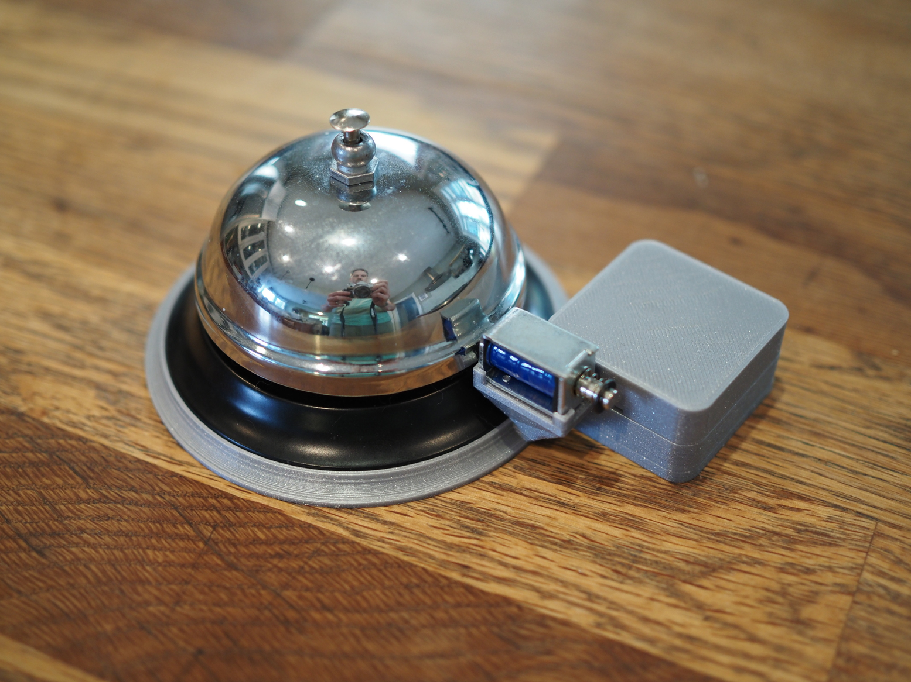

# Analog Terminal Bell

Welcome to the Analog Terminal Bell!

The Analog Terminal Bell is a bell that rings any time a bell character is
displayed on your terminal.  Simply plug the bell in to USB and enable "Analog
Bell" in your terminal settings.

Never miss a terminal bell notification again!

Here is a photo of the bell:

Here is a video explanation:

## Actual Product Details

This bell is not actually for sale.  You have to build it yourself!  This
project uses an MCP2221A microchip to drive a solenoid and hit a bell.

### Electronic Hardware

Information about the electronic hardware to build this project can be found in
the `pcb` folder.  Just check out the [README](pcb/README.md) there for details
on how to build the electronic hardware for this project.

I used through hole components on the PCB to make assembly as easy as possible.

### Physical Hardware

The bell can be found at many stores like [amazon](https://www.amzn.com/s?k=bell) or [staples](https://www.staples.com/call+bell/directory_call%2520bell)

### Software

Unlike an Arduino, this microchip doesn't need any firmware, we can control it
via USB HID.  See the [README](software/README.md) in the `software` folder for
details on how to control the bell from your computer.

Note that if you want iTerm2 to ring the bell like in the commercial, you'll
need a custom build of iTerm2.  You can find the patches for iTerm2
[here](https://github.com/tenderlove/iTerm2/tree/analog-terminal-bell).

### Case and Mounting

The case is 3D printed and the stl files can be found in the [case](case) folder.
